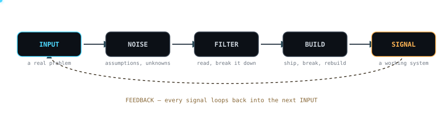

<!--
  you're reading the source. respect.

  fun fact, verified against this account's own commit history:
  GovSense-AI ships with forensic_audit.py, forensic_audit_final.py,
  forensic_audit_fixup.py, AND forensic_audit_v2.py.
  none of them were final. all of them were, eventually, fixed.
  that's basically the whole engineering philosophy below.  — Y
-->

<div align="center">


<sub>ECE Engineer · Building AI, data-driven systems &amp; products</sub>
<br/>
<sub>Python · C · C++ · FastAPI · Flutter</sub>

</div>

<br/>

<div align="center">

`git clone` this energy →
[GovSense-AI](https://github.com/Yuvraj1954/GovSense-AI) ·
[Arrow Escape](https://github.com/Yuvraj1954/Arrow_Escape) ·
[mplads-automation](https://github.com/Yuvraj1954/mplads-automation)

</div>

<br/>

## signal chain // how i build

Trained to think in signals before I ever thought in code — an idea doesn't
ship until it's been through the whole chain, noise and all.

<div align="center">

</div>

<br/>

## on the bench

Not a features list. Just what's actually plugged in right now.

<table>
<tr>
<td width="50%" valign="top">

**GovSense-AI**
Monitoring dashboard for the MPLADS scheme — national overview, MP/MLA
profiles, project analytics, and an AI-assisted risk centre. FastAPI over
two Supabase Postgres instances, deployed on Vercel.
[live](https://smart-india-hackathon-26.vercel.app) · [source](https://github.com/Yuvraj1954/GovSense-AI)

</td>
<td width="50%" valign="top">

**mplads-automation**
The quiet part nobody sees — a Python pipeline that keeps the MPLADS
database current on its own schedule, no manual refresh required.
[source](https://github.com/Yuvraj1954/mplads-automation)

</td>
</tr>
<tr>
<td width="50%" valign="top">

**Arrow Escape**
A silhouette puzzle game, hand-built — no game engine. Clear every arrow,
uncover the shape hiding underneath. Vanilla JS, HTML5, and hand-rolled
SVG rendering, currently in visual-polish pass v0.3.
[play](https://arrow-escape-alpha.vercel.app) · [source](https://github.com/Yuvraj1954/Arrow_Escape)

</td>
<td width="50%" valign="top">

**SafeSakhi**
Contributing Dart/Flutter to a teammate's safety-focused app — proof the
stack above isn't solo-only.
[source](https://github.com/Ankitaaa2506/SafeSakhi)

</td>
</tr>
</table>

<br/>

## stack, mapped by function

Not a logo wall. What each tool is actually *for*.

<div align="center">

</div>

<br/>

## commands i actually run

```bash
$ python forensic_audit_v2.py
> found the bug. it was v1's fault.

$ git commit -m "final fix"
$ git commit -m "actual final fix"
$ git commit -m "ok this one for real this time"
> naming things is hard. cache invalidation is harder. there is no third thing.

$ crontab -l | grep mplads
> the database updates itself before I'm awake.
> one of us is a morning person, and it isn't me.

$ vercel --prod
> shipped from a hackathon room, running on nerves and one Supabase free tier.
```

<br/>

## transmission log

<div align="center">


</div>

<br/>

## system status

<sub>(playful readout, not instrumentation — nothing here is a real metric)</sub>

```
SIGNAL LOCK        ACQUIRED
CURIOSITY          OVERDRIVEN
DEBUGGING          ACTIVE
SLEEP SCHEDULE     UNDER AUDIT
COFFEE             OPTIONAL, RARELY EXERCISED
BUGS               FEATURES PENDING REVIEW
```

<details>
<summary><sub>you scrolled this far. here's the rest of the signal.</sub></summary>
<br/>
<sub>
There's no hidden project, no secret repo, no plot twist here — just someone
who'd rather learn a thing by building a broken version of it first. If
that's the kind of collaborator you're after, the commit history above is
the most honest reference I can give you.
</sub>
</details>

<br/>

---

<div align="center">


<sub><a href="https://github.com/Yuvraj1954">github.com/Yuvraj1954</a></sub>

</div>
