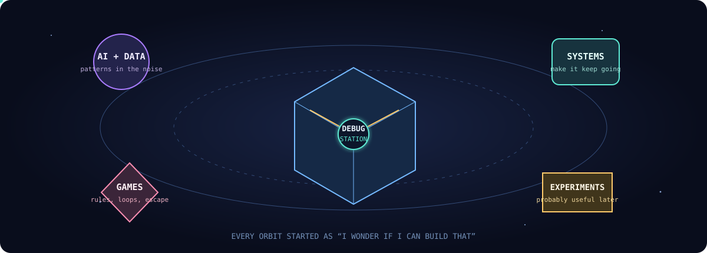
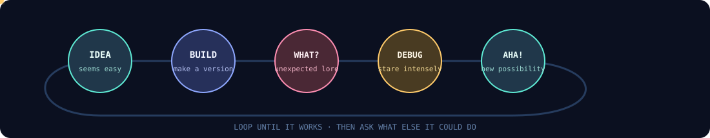

<!--
  you found the maintenance hatch.

  station note: a thing called `forensic_audit_final.py` is evidence that
  the word "final" is a mood, not a contract.
-->

<div align="center">
  
</div>

<br/>

> **STATUS:** a developer currently teaching small machines to do interesting things.
> Python, C/C++, Flutter, FastAPI, data, games, automation — and the slightly reckless idea that it might work.

<div align="center">
  <a href="https://github.com/Yuvraj1954?tab=repositories">open the hangar</a> &nbsp;·&nbsp;
  <a href="https://github.com/Yuvraj1954?tab=commits">read the flight recorder</a> &nbsp;·&nbsp;
  <a href="https://github.com/Yuvraj1954/Arrow_Escape">play something</a>
</div>

<br/>

## the station map

<div align="center">
  
</div>

This is the kind of stuff that keeps the station powered: systems that automate the boring parts, AI and data experiments, game logic, useful tools, and prototypes whose original problem may have vanished three commits ago.

<br/>

## active modules

| Dock | What is inside |
| :-- | :-- |
| `GAME_DECK` | [Arrow Escape](https://github.com/Yuvraj1954/Arrow_Escape) — a hand-built silhouette puzzle game. No game engine; just browser code doing its best. |
| `AUTOMATION_BAY` | [mplads-automation](https://github.com/Yuvraj1954/mplads-automation) — Python jobs that keep a real dataset moving while humans do more human things. |
| `SYSTEMS_LAB` | [GovSense-AI](https://github.com/Yuvraj1954/GovSense-AI) — an AI/data dashboard built with FastAPI and PostgreSQL. The serious project in an otherwise suspiciously playful lab. |
| `CO-OP_CHANNEL` | [SafeSakhi](https://github.com/Ankitaaa2506/SafeSakhi) — contributing Flutter/Dart to a teammate’s safety-focused app. |

<br/>

## build loop // currently uncontained

<div align="center">
  
</div>

```text
$ git commit -m "one tiny cleanup"
  37 files changed, 1 new feature discovered, original cleanup still pending

$ sleep()
  zsh: command not found: sleep
  hint: try building one more thing
```

<br/>

## console inventory

```text
LANGUAGE_CORE      Python · C · C++ · SQL · Dart
BUILD_ENGINES      FastAPI · Flutter · HTML/CSS/JavaScript
DATA_LOCKER        PostgreSQL · Supabase
FAVORITE_BUTTON    "run it and see"
KNOWN_ANOMALY      feature creep detected beyond visual range
```

<details>
<summary><sub>diagnostics // do not press unless curious</sub></summary>
<br/>

```text
BUG DATABASE
├── “I'll only change the README”                 OPEN
├── naming something *_final before it is final   RECURRING
├── one-more-feature syndrome                      BY DESIGN
└── works-on-my-machine                            MACHINE IS NOW IMPORTANT INFRASTRUCTURE
```

<sub>Station policy: broken versions are not failures; they are field research with better stories.</sub>
</details>

<br/>

---

<div align="center">
  
  <br/>
  <sub>transmitting from <a href="https://github.com/Yuvraj1954">github.com/Yuvraj1954</a> · 1954 is a callsign, not a timestamp.</sub>
</div>
