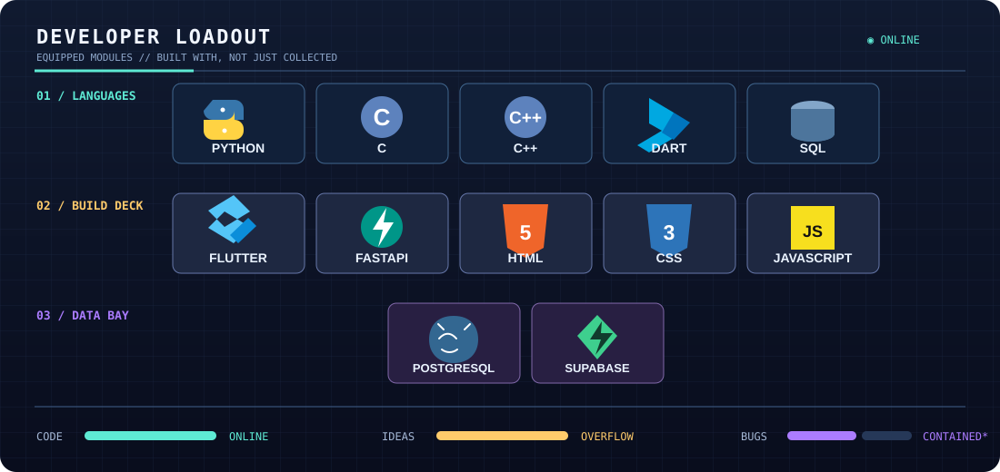

<!--
  you found the maintenance hatch.

  station note: a thing called `forensic_audit_final.py` is evidence that
  the word "final" is a mood, not a contract.
-->

  

 

> **STATUS:** a developer currently teaching small machines to do interesting things.
> Python, C/C++, Flutter, FastAPI, data, games, automation — and the slightly reckless idea that it might work.

  

  

  

 

## developer loadout 

  

 

## transmission log

> **SIGNAL DETECTED:** commits, experiments, and fixes left behind by a terminal session that was supposed to be “quick.”

  
   

  ◉ the grid wakes up after every build
    
  

