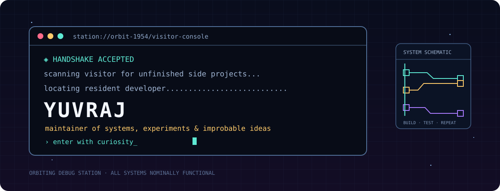

<!--
  you found the maintenance hatch.

  station note: a thing called `forensic_audit_final.py` is evidence that
  the word "final" is a mood, not a contract.
-->

<div align="center">
  
</div>

<br/>

> **STATUS:** a developer currently teaching small machines to do interesting things.
> Python, C/C++, Flutter, FastAPI, data, games, automation — and the slightly reckless idea that it might work.

<div align="center">
  
  
  
</div>

<br/>

## console inventory

```text
LANGUAGE_CORE      Python · C · C++ · SQL · Dart
BUILD_ENGINES      FastAPI · Flutter · HTML/CSS/JavaScript
DATA_LOCKER        PostgreSQL · Supabase
FAVORITE_BUTTON    "run it and see"
KNOWN_ANOMALY      feature creep detected beyond visual range
```

<br/>

## transmission telemetry

<div align="center">
  
  
  <br/>
  
</div>

<details>
<summary><sub>diagnostics // do not press unless curious</sub></summary>
<br/>

```text
BUG DATABASE
├── “I'll only change the README”                 OPEN
├── naming something *_final before it is final   RECURRING
├── one-more-feature syndrome                      BY DESIGN
└── works-on-my-machine                            MACHINE IS NOW IMPORTANT INFRASTRUCTURE
```

<sub>Station policy: broken versions are not failures; they are field research with better stories.</sub>
</details>

<br/>

---

<div align="center">
  <code>◇ YUVRAJ // CALLSIGN: 1954 // BUILD MODE: ON ◇</code>
  <br/><br/>
  <sub>transmitting from <a href="https://github.com/Yuvraj1954">github.com/Yuvraj1954</a> · 1954 is a callsign, not a timestamp.</sub>
</div>
